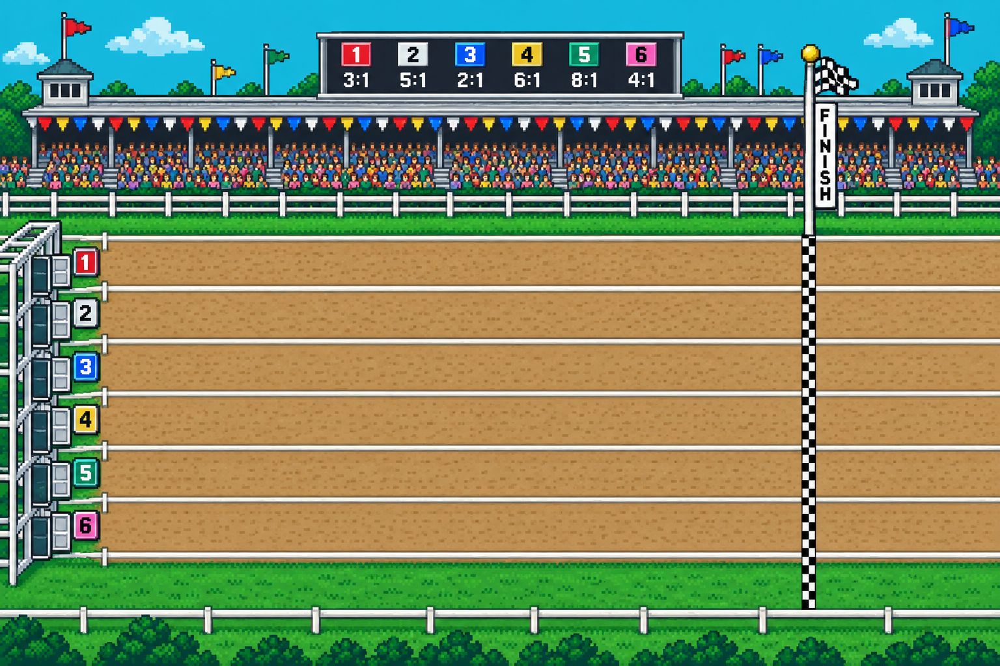

# JoshOS

A Windows 95-style desktop that happens to be my portfolio, with two AI-powered games you can play right on the desktop.

**Live:** [joshmuzi.com](https://joshmuzi.com)

Click around: desktop icons open draggable, resizable windows (About, Projects, Experience, Skills, Resume, Contact), plus **POND.EXE** and **DERBY.EXE**. Don't forget the Compost Bin.

<p align="center">
  
</p>

## The games

Both games follow one rule: **code owns every mechanic; the model only supplies creativity.** Rarity tables, race physics, odds, and the economy are deterministic and testable. Claude Haiku is asked for names, lore, and commentary, and every response is validated against a Zod schema before it touches the game. If the API is slow, over budget, or down, the games fall back to offline content and keep playing.

### POND.EXE
A fishing game with an infinite, AI-invented fish collection. Every catch is a new species: the model names it, writes a line of lore, and picks its color, while a seeded, part-based pixel sprite generator draws it. Four milestone-locked fishing spots with generated scene art, purchasable bait that biases the odds, a shared daily weather line, a persisted FishDex, and a photo mode that exports a shareable card.

### DERBY.EXE
Bet JoshBucks on AI-named creatures in a deterministic race simulation. Six racers with stats and funny traits that carry real mechanics (stall-prone, drama queen, built like a fridge), rubber-banding, and chaos events. Odds are priced by Monte Carlo: 200 simulated runs per race with a house edge, so trait power is priced in automatically. Claude writes the field and calls the race with timestamped commentary; generated pixel horses are tinted per racer in canvas; a live tote board renders the real odds over generated track art. Includes a persisted wallet with refund and settle rules, race history and records, and Vincent, the loan shark.

The two games share one wallet: fish sell into it, the derby bets out of it.

## Architecture highlights

- **Hybrid AI design.** Server routes roll all mechanics in code, then ask the model to write around them. No user text ever reaches a prompt (inputs are validated enums and numbers), and every model response is schema-validated with lenient transforms (clip, clamp) so a slightly long line is trimmed rather than rejected.
- **Cost guardrails, four layers.** Same-origin checks on paid routes, per-IP rate limits, global daily budgets per feature, and a kill switch. Limits, budgets, and AI caches are durable via Upstash Redis in production (per-instance memory in dev), so serverless cold starts don't reset them.
- **Deterministic simulation.** The race sim is a pure function of (card, seed) with fixed RNG consumption order, so the server can price odds, the client can replay at 60fps, and an interrupted race can be settled later from the same seed.
- **Graceful degradation everywhere.** Offline name pools, canned commentary, local race cards, hardcoded weather: any failure lands on playable content, never an error.
- **Desktop window manager.** A React Context + `useReducer` store handling open/close/focus/z-order/minimize/maximize with cascade placement; windows drag and resize via `react-rnd` inside a layer that stops above the taskbar. Phones get a fast single-page layout rendered from the same content, and the desktop bundle is lazy-loaded only when desktop mode engages.
- **Content as data.** Bio, experience, projects, and skills live in typed modules under `src/content/` and feed both layouts.
- **Art pipeline.** Scene art, horses, Vincent, and the icons were generated with AI image tools from prompts I wrote, then processed (crop, quantize, tint, sprite-sheet animation) in code. The fish are fully procedural.

## Project structure

```
src/
  app/            Next.js App Router pages, API routes (pond, derby), icons
  components/     Desktop shell: window manager, windows, taskbar, icons
  content/        Typed content modules (profile, experience, projects, skills)
  games/
    pond/         POND.EXE: sprite generator, reel physics, spots, dex, photo mode
    derby/        DERBY.EXE: sim, odds, traits, track overlay, Vincent
    shared/       JoshBucks wallet
  server/         Anthropic client, guards (rate limit, budget, origin), kv, cache
scripts/          Terminal harnesses: fish-ascii (sprite preview), derby-sim (tuning)
```

## Run it locally

```bash
pnpm install
cp .env.example .env.local   # optional: add ANTHROPIC_API_KEY for live AI
pnpm dev
```

Without an API key everything still runs; the games use their offline fallbacks. See `.env.example` for the workspace id, kill switch, Upstash, and daily budget variables.

Useful checks:

```bash
pnpm exec biome check src     # lint + format
pnpm exec tsc --noEmit        # types
pnpm build                    # production build
npx -y esbuild scripts/derby-sim.mts --bundle --format=esm --outfile=scripts/.derby-sim.mjs && node scripts/.derby-sim.mjs   # race tuning harness
```

## Stack

Next.js 16 (App Router) · TypeScript · Tailwind CSS 4 · react-rnd · Claude API (Haiku) · Zod · Upstash Redis · Canvas · Biome · pnpm · Vercel

## Credits

- [react-rnd](https://github.com/bokuweb/react-rnd) (MIT) for window drag and resize.
- Desktop concept inspired by [posthog.com](https://posthog.com); all code here is original.
- Game art generated with AI image tools from my prompts and processed in code; the fish sprites are procedural.

## License

No license is attached yet. You're welcome to read and learn from the code; please ask before reusing it wholesale. The generated art and content are mine.

---

Josh Muzi · [joshmuzi.com](https://joshmuzi.com) · [jmuzi04@gmail.com](mailto:jmuzi04@gmail.com) · [GitHub](https://github.com/Josh-Muzi) · [LinkedIn](https://www.linkedin.com/in/joshua-muzi-707386b2)
